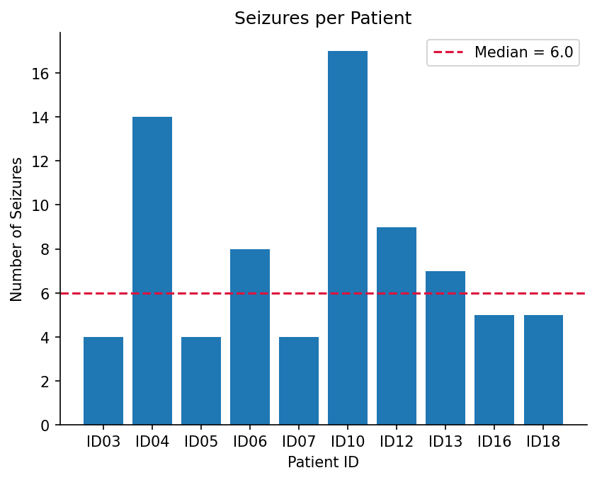
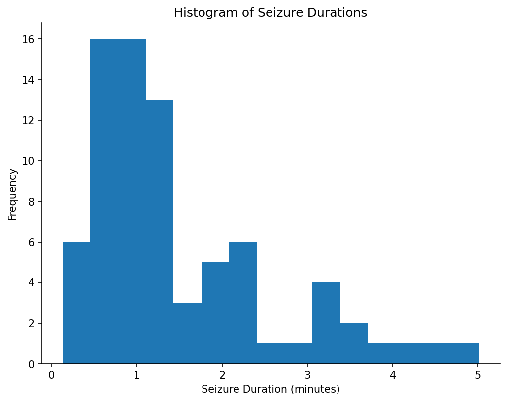
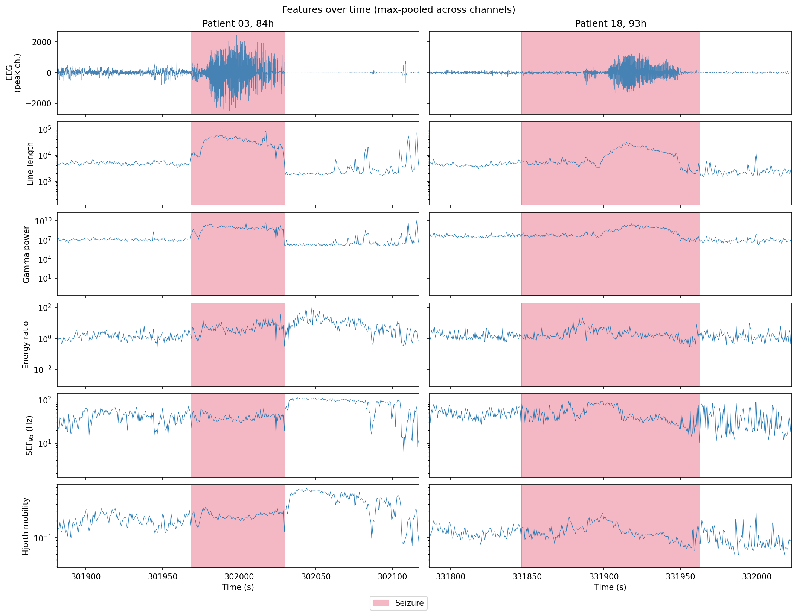
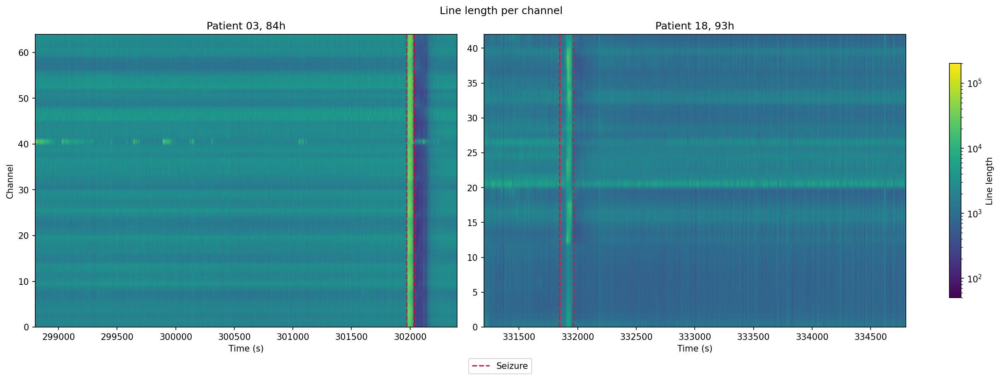
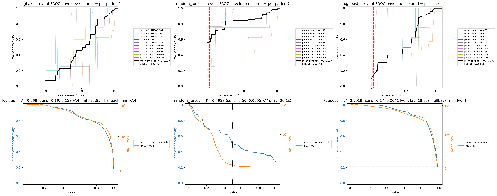

# Seizure Onset Detection on iEEG
Automated seizure onset detection on intracranial EEG, comparing classical
ML baselines (logistic regression, random forest) with a temporal CNN.


## Quickstart

```bash
git clone https://github.com/tshibei/seizure-onset-detector
cd seizure-onset-detector
uv sync --all-extras
uv run nbstripout --install   # strip notebook outputs on commit
uv run pytest
```

### Reproducing the dataset

Seizure onset/offset times in the info files are in seconds from recording start (0-indexed), while hourly files are 1-indexed — a seizure at 297,000s (82.5h) is in `_83h.mat`. The cohort and per-patient file lists are defined declaratively in `scripts/download_swec.py`:

```bash
uv run python scripts/download_swec.py
```

## Methods
### Data
 
We use the [SWEC-ETHZ long-term iEEG dataset](https://ieeg-swez.ethz.ch/),
which contains continuous intracranial EEG recordings from 18 patients
undergoing pre-surgical evaluation for drug-resistant epilepsy. Recordings
are provided as hourly `.mat` files numbered `_1h.mat` through `_Nh.mat`,
with per-patient annotation files (`IDxx_info.mat`) listing seizure onset
and offset times in seconds from recording start.
 
### Cohort selection
We include patients with at least 3 annotated seizures and fewer than 8 seizures in any 4-hour window. The density criterion excludes patients whose annotations are consistent with status epilepticus or pipeline-level subdivision of a single prolonged event into many sub-events — including these would inflate per-patient seizure counts and give a small number of patients disproportionate weight in leave-one-patient-out evaluation.

8 of 18 patients were excluded: ID01, ID02, ID11, ID15, ID17 (<3 seizures); ID08, ID09, ID14 (dense clustering). The remaining 10 patients form the study cohort. For each, we also download 4 interictal hours spaced across the recording to provide negative examples and support false-positives-per-hour estimation.

### Final cohort
We use 10 patients from the [SWEC-ETHZ iEEG dataset](https://ieeg-swez.ethz.ch/),
covering sampling rates of 512–1024 Hz and 32–128 implanted channels. Across 10 patients, we have 4–17 seizures each (median 6), with channel counts of 32–128 and sampling rates of 512 or 1024 Hz. 

| Patient   |   Seizures |   Sampling Rate (Hz) |   Channels |   Downloaded (h) |   Ictal (%) |
|:----------|-----------:|---------------------:|-----------:|-----------------:|------------:|
| ID03      |          4 |                  512 |         64 |                8 |         0.9 |
| ID04      |         14 |                 1024 |         32 |               17 |         1.0 |
| ID05      |          4 |                  512 |        128 |                9 |         0.2 |
| ID06      |          8 |                 1024 |         32 |               12 |         0.8 |
| ID07      |          4 |                  512 |         75 |                8 |         1.0 |
| ID10      |         17 |                 1024 |         32 |               20 |         1.7 |
| ID12      |          9 |                 1024 |         56 |               13 |         2.8 |
| ID13      |          7 |                 1024 |         64 |               11 |         1.8 |
| ID16      |          5 |                 1024 |         34 |                9 |         2.9 |
| ID18      |          5 |                 1024 |         42 |                9 |         3.1 |

*Recordings were sub-sampled around seizure events, so the ictal fraction
shown here substantially exceeds what would be observed in continuous
monitoring. FPR/hour reported in Results should be interpreted with this
in mind.* 



*Seizure occurrence across downloaded recordings.*



*Most seizures are <1.5 minutes.*

### Signal Processing
A notch filter of 50 Hz is applied. Note that the dataset is originally bandpass filtered from 0.5 - 120 Hz. 

### Features
Signals were MAD_normalized per channel and recording before feature extraction. 

We extract five feature families per 1-second window with 50% overlap, computed per channel and pooled across channels using mean and maximum:
- Line length (sum of absolute first differences)
- Band power in 5 standard EEG bands (delta 0.5–4 Hz, theta 4–8 Hz, alpha 8–13 Hz, beta 13–30 Hz, gamma 30–80 Hz)
- Spectral edge frequency (SEF95)
- Hjorth parameters (activity, mobility, complexity)
- Energy ratio (Bartolomei et al. 2008): fast/slow band power



*Features over 1-second windows around seizures in two patients (±60 s, seizure shaded). ID03 shows sharp elevation across features; ID18 is subtler, with energy ratio unresponsive — motivating a multi-feature approach.*



*Line length per channel for the same seizures. ID03's seizure recruits all channels uniformly; ID18's is focal and includes a persistent artifact on channel 20 — motivating both mean and max pooling.*

### Classifiers
Classical ML: logistic regression, random forest, XGBoost, all with class weights to handle class imbalance; implemented with `sklearn`;

Binary per-window scores (window size of one second, step size of 0.5s) are considered as alarms. Alarms are converted to seizure detections if an alarm is sustained for at least three seconds, merged for gaps within five seconds. This helps to debounce the alarm detection. A 5min seizure refractory period is imposed, meaning that there will not be multiple seizure detections within 5min of a seizure detection. 

### Evaluation
Leave one patient out cross valuation was implemented. Features were MAD-normalized in the training set, and the parameters from the training set were used to normalize the test set for each fold. 

The metrics used for evaluation are event-based, with reference to the SzCORE Framework. Note that scalp-tuned tolerances are applied to intracranial data, and FP/h is reported instead due to non-continuous hourly recordings downloaded in consideration of memory capacity with sufficient number of patients for analysis.

## Repository structure


## Status

Complete: data pipeline, features, and EDA validation. Classifier and results coming.

## Results

### Classical ML Baselines: Logistic Regression, Random Forest, XGBoost
The threshold-free metric AUPRC showed the best performance in the random forest model. Random Forest 0.79 > XGBoost 0.74 > Logistic Regression 0.54. 

The operating point is chosen to reach the clinical target of false alarm rate of 0.06/h (to match SOTA performance in Sun et al, 2022, IEEE Journal of Biomedical and Health Informatics using transformers and Truong et al., 2018, Neural Networks using CNNs) if it can reach it, otherwise at its FA-floor. 



| model         |   AUPRC |   FA/h |   sens |   precision |   latency (s) | FA/h at target (0.06/h)?   |
|:--------------|--------:|-------:|-------:|------------:|----------:|:---------------------------|
| logistic      |  0.5434 | 0.1577 |  0.185 |       0.6   |      35.8 | floor >> target            |
| random_forest |  0.7937 | 0.0595 |  0.502 |       0.788 |      26.1 | at target                  |
| xgboost       |  0.7399 | 0.0641 |  0.173 |       1     |      18.5 | floor > target             |

### Failure Mode Analysis
**Sensitivity floor in Random Forest model:** RF event sensitivity plateaus at ~0.68 across a wide threshold band (FA/h 0.4–1.0); loosening the threshold past that adds false alarms, not detections. So roughly a third of seizure events are missed regardless of operating point. This is consistent with the focal seizures seen in EDA — ID18's onset recruits only channels ~12–14 and ~37–41, and mean/max pooling across all 64 channels dilutes a spatially focal onset into the background. Generalized seizures (ID03, all channels) may be caught successfully, versus focal ones. Potential fix include per-channel or top-k channel features instead of global pooling.

**Single global threshold underperforms per-patient tuning:** The black mean-envelope reaches higher sensitivity at the floor/target FA/h, but a shared threshold across patients caps much lower — the gap is the cost of one threshold over a heterogeneous cohort, visible in how widely the per-patient FROC curves spread. Some patients are detectable, some plateau well below 1.0 even at 10 FA/h. Future work: per-patient normalization or calibration.

**Poor AUPRC of Logistic Regression:** The AUPRC of logistic regression is at 0.54 — pooled linear features barely separate ictal from interictal. This is the expected baseline floor and the motivation for the nonlinear models.

## Limitations

### Sub-sampling of recordings
- We sub-sampled the long-term recordings, prioritizing files containing seizures plus interictal context. Ictal fraction in the downloaded subset is therefore much higher than in the full continuous recording.  

- FPR/hour is computed on a sub-sampled interictal set rather than continuous monitoring; deployment FPR would likely be higher.

### Features at recording level
- Recording-level pooling does not exploit per-channel onset zone information (see `Methods/Features`)

### No held-out test set
LOOCV uses every patient for both training and evaluation across folds. Per-patient AUPRC reported in Results reflects within-cohort generalization; performance on patients outside SWEC-ETHZ is not assessed.
